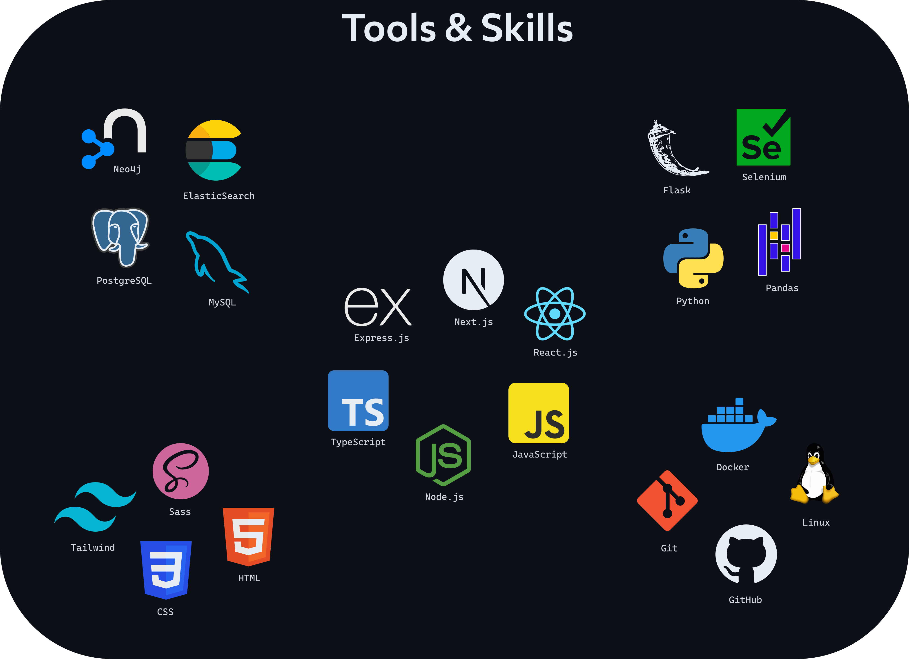

# Hi, I'm Boris

**`🛠️ Professional Websmith • TypeScript & Python`**

I'm a full-stack developer fluent in **TypeScript** and **Python**.

• I've worked with TypeScript libraries and frameworks like **React.js** and **Next.js**  
• I've built backends with **Flask** in Python and **Express.js** in TypeScript, making type-safe endpoints with **tRPC**  
• I've used both plain **CSS** as well as postprocessors like **Sass** or libraries like **Tailwind** and **Bootstrap**  
• I've had experience with traditional **SQL**, as well as graph DBs like **Neo4j**  
• I've **Dockerized** some of the applications that I've built

My aim is to continue getting better at software development. I learn fast.

    
   
  
   

---

### Tools & Skills

